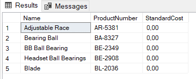
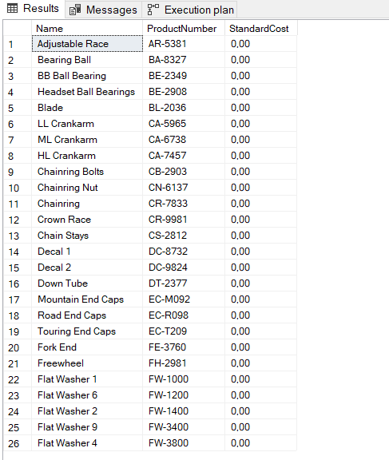
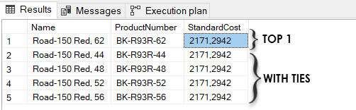

## **Note**

link of my [problem](https://stackoverflow.com/questions/20853725/what-is-the-use-of-with-ties-keyword-in-select-statement-in-sql-queries)

```sql

-- Syntax

SELECT TOP (expression) [PERCENT]
    [WITH TIES]
FROM 
    table_name

```

```sql

SELECT TOP (5) Name, 
    ProductNumber, 
    StandardCost
FROM Production.Product;

```




#### **Example**

* The following query will return 20 percent of rows in the table.
* link:  https://www.sqlshack.com/sql-select-top-statement-overview-and-examples/


```sql

SELECT TOP (20) PERCENT Name, 
    ProductNumber, 
    StandardCost
FROM Production.Product;

```



* The WITH TIES keyword enables to include the rows into the result set that matches with the last row.
* link:  https://www.sqlshack.com/sql-select-top-statement-overview-and-examples/


```sql

SELECT TOP (1) WITH TIES Name, 
    ProductNumber, 
    StandardCost
FROM Production.Product
ORDER BY StandardCost DESC

```


